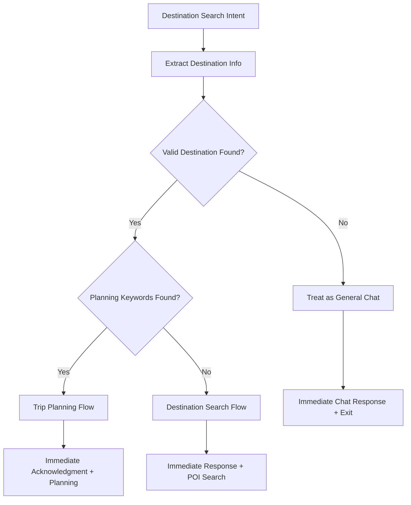

# Improved Destination Search Intent Flow

## Overview
I've enhanced the destination search flow to be more intelligent about distinguishing between general chat, destination search, and trip planning, with better response timing and user experience.

## Key Improvements Made

### 1. **Enhanced Intent Classification**
**File:** `/Backend/src/agents/intent.ts`

**Improvements:**
- More detailed examples for each intent type
- Better handling of edge cases (thank you, yes, no, etc.)
- Conservative approach: when in doubt, prefer CHAT over DESTINATION_SEARCH
- Clear distinction between trip planning vs destination search

**Examples:**
```typescript
// PLAN_TRIP: Explicit planning intent
"plan a trip to goa"
"create 5-day itinerary for Japan" 
"help me plan a trip to mumbai"

// DESTINATION_SEARCH: Information about destinations
"show me places in ooty"
"what to do in coonoor"
"restaurants in goa"

// CHAT: General conversation
"that sounds great"
"thank you"
"how does this work?"
```

### 2. **Smarter Destination Search Node**
**File:** `/Backend/src/graph/graph.ts`

**New Flow:**


**Key Features:**
- **Step 1**: Extract destination info first to validate intent
- **Step 2**: If no valid destination found → treat as general chat
- **Step 3**: If valid destination + planning keywords → trigger trip planning
- **Step 4**: If valid destination only → proceed with destination search
- **Always**: Provide immediate user response before heavy processing

### 3. **Conservative Destination Extraction**
**File:** `/Backend/src/agents/destination.ts`

**Improvements:**
- More conservative AI prompts with explicit edge cases
- Enhanced heuristic fallback that filters out conversational phrases
- Better validation of extracted destinations
- Filters out common words that aren't destinations

**Conservative Filtering:**
```typescript
const conversationalPhrases = [
  'that sounds great', 'sounds good', 'thank you', 'thanks', 
  'yes', 'no', 'ok', 'okay', 'tell me more', 'what do you recommend',
  'how does this work', 'who are you', 'what is your name'
];
```

## Response Timing Improvements

### Before (Issues)
1. **Immediate Response**: Generated for all destination_search intents regardless of validity
2. **No Validation**: Didn't check if destination was actually mentioned
3. **Inefficient**: Always proceeded with POI search even for general chat
4. **Poor UX**: Generic responses for conversational messages

### After (Improved)
1. **Smart Validation**: First checks if destination is actually mentioned
2. **Appropriate Routing**: Routes to chat if no valid destination found
3. **Immediate Feedback**: Quick responses for valid destination searches
4. **Efficient Processing**: Only triggers POI search when necessary

## Flow Examples

### Example 1: General Chat Misclassified as Destination Search
**User**: "That sounds great!"
**Intent**: DESTINATION_SEARCH (misclassified)

**Old Flow:**
1. Generate generic chat response
2. Try to extract destinations (fails)
3. Still proceed with POI search
4. Return empty results

**New Flow:**
1. Try to extract destinations → no valid destination found
2. Route to general chat handling
3. Generate appropriate conversational response
4. Exit early, no unnecessary processing

### Example 2: Valid Destination Search
**User**: "Show me places in Ooty"
**Intent**: DESTINATION_SEARCH

**Flow:**
1. Extract destination → "Ooty" found ✓
2. Check planning keywords → None found
3. Generate immediate response: "Great choice! I'm searching for amazing places in **Ooty**..."
4. Trigger POI search in background
5. Show search results

### Example 3: Trip Planning via Destination Search
**User**: "Plan a trip to Goa"
**Intent**: DESTINATION_SEARCH

**Flow:**
1. Extract destination → "Goa" found ✓
2. Check planning keywords → "plan" found ✓
3. Generate immediate acknowledgment
4. Trigger full trip planning flow
5. Generate itinerary and POI search

## Technical Benefits

### Performance
- **Reduced API Calls**: No unnecessary POI searches for conversational messages
- **Faster Responses**: Immediate validation prevents wasted processing
- **Smart Routing**: Early exit for non-destination queries

### User Experience
- **Appropriate Responses**: Conversational replies for chat, informative replies for searches
- **Quick Feedback**: Users get immediate acknowledgment
- **Better Flow**: Smooth transitions between chat and search modes

### Reliability
- **Conservative Approach**: Reduces false positives in destination detection
- **Fallback Handling**: Robust heuristic extraction as backup
- **Error Resilience**: Graceful handling of edge cases

## Configuration

No additional configuration required. The improvements work with existing:
- Google Places API integration
- Gemini AI models
- WebSocket event system
- Database schema

## Testing Scenarios

### Test Cases to Verify
1. **Conversational Messages**:
   - "That sounds great" → Should get chat response, no POI search
   - "Thank you" → Should get chat response, no POI search
   - "Yes" → Should get chat response, no POI search

2. **Valid Destination Search**:
   - "Show me places in Ooty" → Should get destination-specific response + POI search
   - "Restaurants in Mumbai" → Should get destination-specific response + POI search

3. **Trip Planning**:
   - "Plan a trip to Goa" → Should trigger full planning flow
   - "Create itinerary for Kerala" → Should trigger full planning flow

4. **Edge Cases**:
   - "I want to visit" (incomplete) → Should get chat response asking for destination
   - "What do you recommend?" → Should get chat response asking for destination

The improved flow ensures users get appropriate, immediate responses while reducing unnecessary processing and improving overall system efficiency.