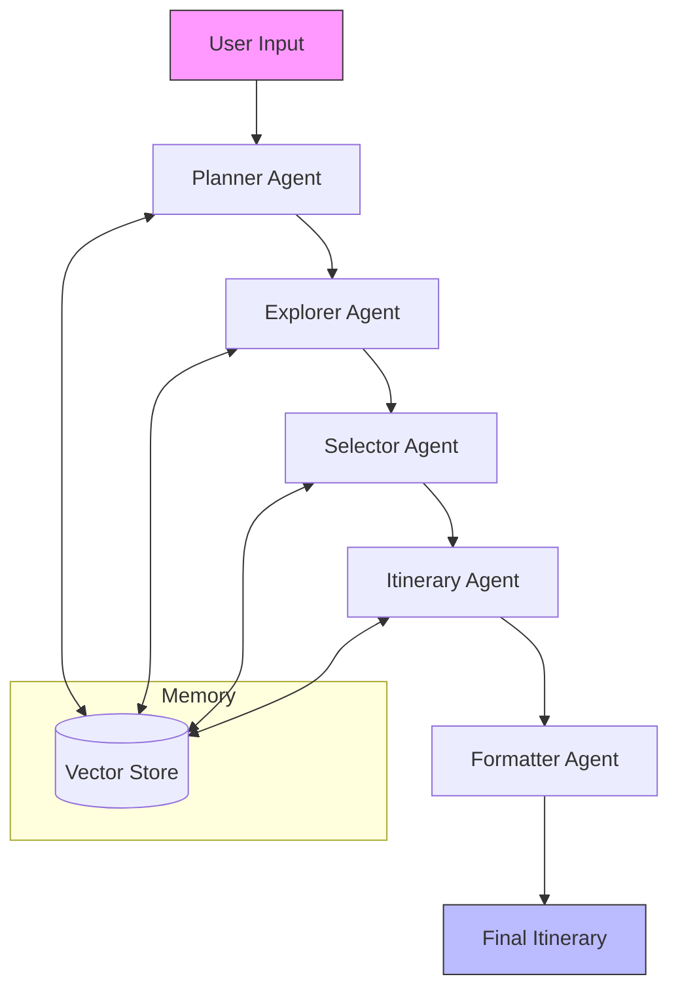

# Roameo : Multi-Agent AI powered Travel Planner

[](https://www.python.org/downloads/)
[](https://opensource.org/licenses/MIT)
[](https://github.com/psf/black)

Roameo is an advanced AI-powered travel planning system that leverages multiple specialized agents to create personalized, optimized travel itineraries. Built with LangChain and LangGraph, it supports various LLM providers including Google's Gemini and open models via Groq.

## 🌟 Key Features

- **Multi-Agent Architecture**: Specialized agents handle different aspects of travel planning
- **Flexible LLM Integration**: Supports Gemini, Mistral, and other models via Groq
- **Comprehensive Planning**: From destination research to daily schedules
- **Budget-Aware**: Creates plans that respect your financial constraints
- **Interactive CLI**: Easy-to-use command line interface
- **Extensible**: Modular design for adding new features and integrations

## 🏗️ System Architecture

Roameo is built on a multi-agent architecture where each agent specializes in a specific aspect of travel planning:



### Core Agents

1. **Planner Agent**
   - Parses natural language requests into structured data
   - Extracts key information (destination, duration, preferences)
   - Handles fallback parsing for edge cases

2. **Explorer Agent**
   - Discovers points of interest (POIs)
   - Integrates with external APIs for real-time data
   - Caches results for better performance

3. **Selector Agent**
   - Curates and filters POIs based on user preferences
   - Handles user selection when needed
   - Balances must-see attractions with hidden gems

4. **Itinerary Agent**
   - Creates optimized daily schedules
   - Handles time allocation and travel between locations
   - Includes fallback logic for robust operation

5. **Budget Agent**
   - Estimates costs for activities and accommodations
   - Provides budget-aware recommendations
   - Supports multiple currencies (default: INR)

6. **Formatter Agent**
   - Presents information in various formats (Markdown, JSON, HTML)
   - Ensures consistent, readable output
   - Handles edge cases gracefully

## 🚀 Features

### Core Capabilities

- **Multi-agent System**: Specialized agents for planning, research, and optimization
- **Natural Language Understanding**: Parse complex travel requests and preferences
- **Destination Research**: Find hidden gems and popular attractions
- **Smart Itinerary Generation**: Create realistic, well-paced daily schedules
- **Budget-Aware Planning**: Optimize experiences based on your budget (default: INR)
- **Real-time Integration**: Access to live data for weather and events
- **Personalization**: Adapt to travel styles (adventure, luxury, budget, family, etc.)
- **Error Resilience**: Robust fallback mechanisms at every step

### Supported LLM Providers

- **Google Gemini** (via `langchain-google-genai`)
- **Mistral** (via Groq)
- **Llama 3** (via Groq)
- **Gemma** (via Groq)

### Data Models

Key Pydantic models used throughout the system:

- `TravelPlanRequest`: Structured user request
- `PointOfInterest`: Attraction/activity details
- `Activity`: Scheduled event in an itinerary
- `DailyItinerary`: Schedule for a single day
- `TravelItinerary`: Complete trip plan

## 🚀 Quick Start

### Prerequisites
- Python 3.9+
- pip (Python package manager)

### Installation

1. Clone the repository:
   ```bash
   git clone <repository-url>
   cd Plan
   ```

2. Create and activate a Python virtual environment:
   ```bash
   # On macOS/Linux
   python -m venv venv
   source venv/bin/activate
   
   # On Windows
   # python -m venv venv
   # venv\Scripts\activate
   ```

3. Install the required dependencies:
   ```bash
   pip install -r requirements.txt
   ```

4. Set up your environment variables:
   ```bash
   cp .env.example .env
   ```
   Then edit the `.env` file to add your API keys.

## 🔧 Configuration

### Environment Variables

Create a `.env` file in the project root with the following variables:

```
# Required for Google's Gemini models
GOOGLE_API_KEY=your_google_api_key

# Required for Groq's hosted models (like Mixtral)
GROQ_API_KEY=your_groq_api_key

# Optional: Set default model (default: "mixtral-8x7b-32768")
DEFAULT_MODEL=mixtral-8x7b-32768
```

### Available Models

- `gemini-1.5-flash` (Google)
- `mixtral-8x7b-32768` (Groq, default)
- `llama2-70b-4096` (Groq)
- `gemma-7b-it` (Groq)

## 🚀 Quick Start

### Prerequisites

- Python 3.9+
- [Poetry](https://python-poetry.org/) (recommended) or pip
- API keys for your chosen LLM providers

### Installation

1. Clone the repository:
   ```bash
   git clone <repository-url>
   cd Plan
   ```

2. Install dependencies:
   ```bash
   # Using Poetry (recommended)
   poetry install
   
   # Or using pip
   pip install -r requirements.txt
   ```

3. Set up environment variables:
   ```bash
   cp .env.example .env
   # Edit .env with your API keys
   ```

### Configuration

Edit the `.env` file with your API keys:

```env
# Required for Google's Gemini models
GOOGLE_API_KEY=your_google_api_key

# Required for Groq's hosted models
GROQ_API_KEY=your_groq_api_key

# Optional: Set default model
DEFAULT_MODEL=gemini-1.5-flash  # or mixtral-8x7b-32768, llama2-70b-4096, etc.
```

## 🛠️ Tech Stack

- **Language**: Python 3.9+
- **Core Frameworks**:
  - LangChain for LLM orchestration
  - LangGraph for workflow management
  - Pydantic for data validation
  - FastAPI for web interface (future)
- **LLM Providers**:
  - Google Gemini 1.5 Flash
  - Mistral 7B (via Groq)
  - Mixtral 8x7B (via Groq)
  - Llama 2 70B (via Groq)
- **Key Dependencies**:
  - `python-dotenv` for configuration
  - `requests` for API calls
  - `rich` for CLI formatting
  - `python-dateutil` for date handling

## 🗂 Project Structure

```
Plan/
├── .env.example            # Example environment variables
├── requirements.txt        # Python dependencies
├── pyproject.toml          # Poetry configuration
├── README.md               # This file
├── tests/                  # Test files
└── travel_agent/           # Main package
    ├── __init__.py         # Package initialization
    ├── base.py             # Base classes and interfaces
    ├── models.py           # Pydantic data models
    │
    ├── agents/             # Agent implementations
    │   ├── __init__.py
    │   ├── base_agent.py   # Base agent class
    │   ├── planner_agent.py
    │   ├── explorer_agent.py
    │   ├── selector_agent.py
    │   ├── itinerary_agent.py
    │   ├── budget_agent.py
    │   └── formatter_agent.py
    │
    ├── utils/              # Utility functions
    │   ├── __init__.py
    │   └── model_config.py # LLM configuration
    │
    ├── workflow.py         # LangGraph workflow
    └── cli.py             # Command-line interface
```

## 💻 Usage

### Command Line Interface (CLI)

Run the interactive CLI:

```bash
# Using Poetry
poetry run python -m travel_agent.cli

# Or directly
python -m travel_agent.cli
```

Example interaction:
```
Welcome to Roameo Travel Planner!

Enter your travel request (or 'quit' to exit):
> I want to visit Araku for 1 day from Vizag. I love nature and local culture.

[Processing your request...]

=== Your Travel Itinerary ===

Day 1: Exploring Araku Valley
--------------------------
09:00 - 10:30: Araku Valley View Point
  Location: Araku Valley, Andhra Pradesh
  Breathtaking views of the Araku Valley. Best visited in the morning for clear views.

10:30 - 11:00: Travel to Borra Caves
  Travel time to Borra Caves

11:00 - 13:00: Borra Caves
  Million-year-old limestone caves with stunning formations.

...
```

### Programmatic Usage

```python
import asyncio
from travel_agent.workflow import create_travel_planner_workflow

async def plan_trip():
    # Create the workflow
    workflow = create_travel_planner_workflow()
    
    # Initialize with user input
    initial_state = {
        "user_input": "I want to visit Araku for 1 day from Vizag. I love nature and local culture.",
        "travel_request": None,
        "suggested_pois": [],
        "selected_pois": [],
        "itinerary": None,
        "messages": [],
        "status": "planning",
        "error": None
    }
    
    # Run the workflow
    result = await workflow.ainvoke(initial_state)
    return result

# Run the async function
if __name__ == "__main__":
    result = asyncio.run(plan_trip())
    print(result["itinerary"])
```

## 🧪 Testing

Run the test suite:
```bash
pytest tests/
```

## 🧪 Testing

Run the test suite:

```bash
# Run all tests
pytest

# Run a specific test
pytest tests/test_itinerary_agent.py -v

# Run with coverage report
pytest --cov=travel_agent tests/
```

### Example Test: Araku Day Trip

```python
# tests/test_araku_itinerary.py
import asyncio
from travel_agent.itinerary_agent import test_itinerary_agent

async def test_araku_day_trip():
    itinerary = await test_itinerary_agent(
        destination="Araku",
        duration_days=1,
        origin="Vizag"
    )
    assert len(itinerary.daily_plans) == 1
    assert len(itinerary.daily_plans[0].activities) > 0
```

## 🚀 Deployment

### Local Development

1. Install development dependencies:
   ```bash
   poetry install --with dev
   ```

2. Start the development server:
   ```bash
   uvicorn travel_agent.api:app --reload
   ```

3. Access the API at `http://localhost:8000`

### Production

1. Build a Docker image:
   ```bash
   docker build -t roameo-travel-planner .
   ```

2. Run the container:
   ```bash
   docker run -p 8000:8000 --env-file .env roameo-travel-planner
   ```

## 🤝 Contributing

We welcome contributions! Here's how you can help:

1. 🍴 Fork the repository
2. 🌿 Create a feature branch (`git checkout -b feature/amazing-feature`)
3. 💾 Commit your changes (`git commit -m 'Add some amazing feature'`)
4. 🔄 Push to the branch (`git push origin feature/amazing-feature`)
5. ✨ Open a Pull Request

### Development Setup

1. Set up pre-commit hooks:
   ```bash
   pre-commit install
   ```

2. Run the test suite:
   ```bash
   pytest
   ```

3. Format your code:
   ```bash
   black .
   isort .
   ```

## 📄 License

This project is licensed under the MIT License - see the [LICENSE](LICENSE) file for details.

## 🙏 Acknowledgments

- [LangChain](https://github.com/langchain-ai/langchain) for LLM orchestration
- [LangGraph](https://github.com/langchain-ai/langgraph) for workflow management
- [Google AI](https://ai.google.dev/) for the Gemini models
- [Groq](https://groq.com/) for high-performance LLM inference
- [Pydantic](https://pydantic.dev/) for data validation

---

Made with ❤️ by [Your Name] | [GitHub Profile]

## 🤝 Contributing

We welcome contributions! Here's how you can help:

1. 🍴 Fork the repository
2. 🌿 Create a feature branch (`git checkout -b feature/amazing-feature`)
3. 💾 Commit your changes (`git commit -m 'Add some amazing feature'`)
4. 🔄 Push to the branch (`git push origin feature/amazing-feature`)
5. ✨ Open a Pull Request

### Development Setup
```bash
# Install dependencies
poetry install

# Run tests
pytest

# Start development server
uvicorn travel_agent.api:app --reload
```

## 📄 License

This project is licensed under the MIT License - see the [LICENSE](LICENSE) file for details.

## 🙏 Acknowledgments

- [LangChain](https://github.com/langchain-ai/langchain) for the LLM orchestration framework
- [LangGraph](https://github.com/langchain-ai/langgraph) for workflow orchestration
- [Google AI](https://ai.google.dev/) for the Gemini models
- [Groq](https://groq.com/) for high-performance LLM inference

---

Made with ❤️ by [Your Name] | [GitHub Profile]
I have a medium budget and I'm traveling with my partner. We love walking and
want to experience local culture. We don't like crowded tourist traps.
```

## Project Structure

- `travel_agent/`
  - `base.py`: Base classes and data models
  - `planner_agent.py`: Parses user input into structured data
  - `explorer_agent.py`: Discovers points of interest
  - `selector_agent.py`: Helps select preferred points of interest
  - `itinerary_agent.py`: Generates day-by-day travel plans
  - `main.py`: Main orchestration and CLI interface

## Configuration

You can configure the behavior of the agents by modifying their initialization in `main.py`:

```python
# Example configuration
planner = TravelPlanner(
    planner_model="gemini-1.5-flash",
    explorer_model="mixtral-8x7b-32768",
    selector_model="mixtral-8x7b-32768",
    itinerary_model="gemini-1.5-flash"
)
```

## Contributing

Contributions are welcome! Please feel free to submit a Pull Request.

## License

This project is licensed under the MIT License - see the [LICENSE](LICENSE) file for details.
