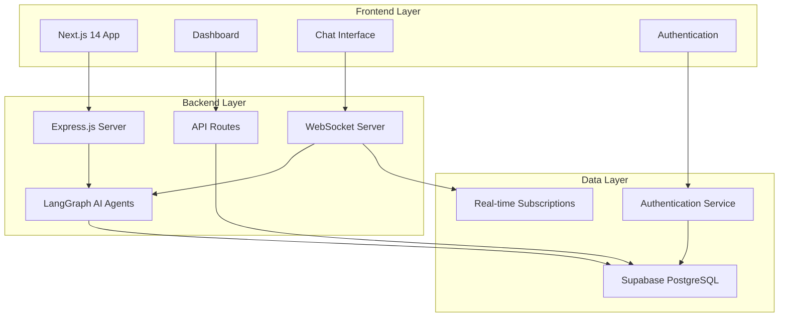
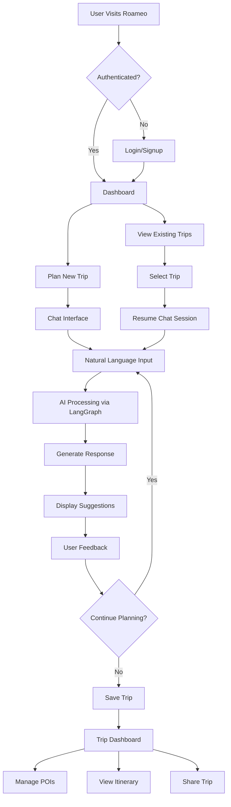
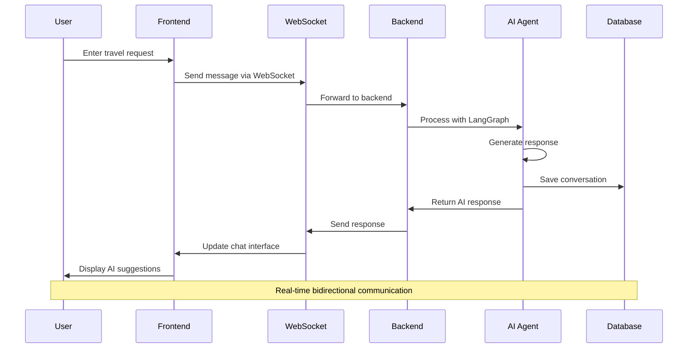
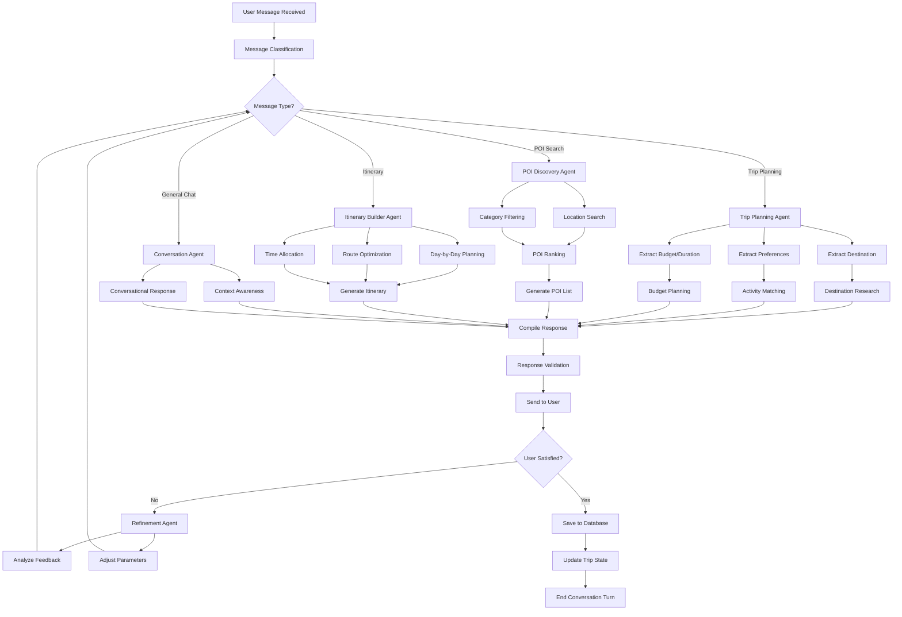
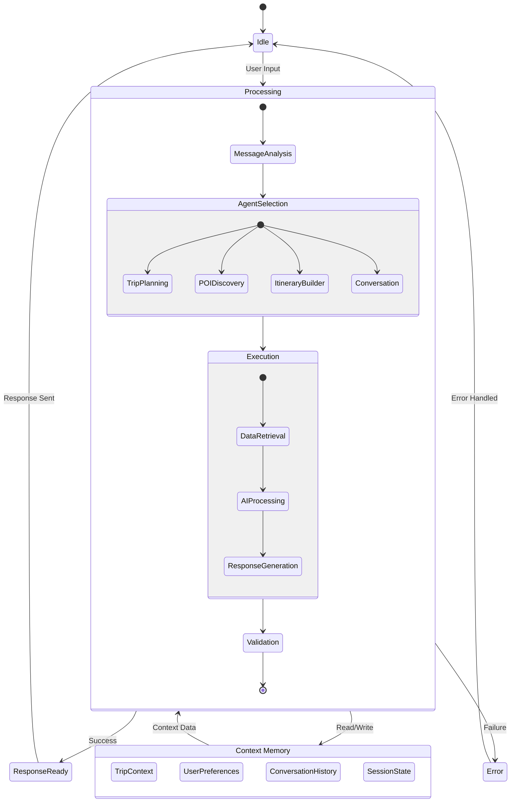

# Roameo - Multi-Agent AI Travel Planning Assistant

Roameo is an intelligent multi-agent AI travel planning platform that helps users create personalized itineraries through natural language conversations. Built with LangGraph multi-agent architecture and modern web technologies, it provides an intuitive chat-based interface powered by specialized AI agents for comprehensive trip planning.

## 🏗️ Architecture

### System Architecture Diagram


```mermaid
graph TB
    subgraph "Frontend Layer"
        A[Next.js 14 App]
        B[Dashboard]
        C[Chat Interface]
        D[Authentication]
    end
    
    subgraph "Backend Layer"
        E[Express.js Server]
        F[WebSocket Server]
        G[LangGraph AI Agents]
        H[API Routes]
    end
    
    subgraph "Data Layer"
        I[Supabase PostgreSQL]
        J[Authentication Service]
        K[Real-time Subscriptions]
    end
    
    A --> E
    B --> H
    C --> F
    D --> J
    E --> G
    F --> G
    G --> I
    H --> I
    J --> I
    F --> K
```

### Component Architecture

```
┌─────────────────────────────────────────────────────────────┐
│                    FRONTEND (Next.js 14)                   │
├─────────────────────────────────────────────────────────────┤
│  Dashboard    │    Chat Interface    │    Authentication    │
│  ┌─────────┐  │  ┌─────────────────┐ │  ┌─────────────────┐ │
│  │ Trip    │  │  │ Message Panel   │ │  │ Login/Signup    │ │
│  │ Cards   │  │  │ Input Field     │ │  │ User Profile    │ │
│  │ POI     │  │  │ WebSocket       │ │  │ Session Mgmt    │ │
│  │ Manager │  │  │ Connection      │ │  │                 │ │
│  └─────────┘  │  └─────────────────┘ │  └─────────────────┘ │
└─────────────────────────────────────────────────────────────┘
                            │
                    HTTP/WebSocket
                            │
┌─────────────────────────────────────────────────────────────┐
│                 BACKEND (Node.js + Express)                │
├─────────────────────────────────────────────────────────────┤
│  API Routes   │    WebSocket Server   │    AI Processing   │
│  ┌─────────┐  │  ┌─────────────────┐  │  ┌─────────────────┐ │
│  │ /trips  │  │  │ Chat Sessions   │  │  │ LangGraph       │ │
│  │ /pois   │  │  │ Real-time Msgs  │  │  │ Conversation    │ │
│  │ /auth   │  │  │ User Presence   │  │  │ Flow Engine     │ │
│  └─────────┘  │  └─────────────────┘  │  └─────────────────┘ │
└─────────────────────────────────────────────────────────────┘
                            │
                      Database Queries
                            │
┌─────────────────────────────────────────────────────────────┐
│                  DATABASE (Supabase)                       │
├─────────────────────────────────────────────────────────────┤
│     trips     │     messages     │     pois     │   users   │
│  ┌─────────┐  │  ┌─────────────┐ │  ┌─────────┐ │ ┌───────┐ │
│  │ id      │  │  │ id          │ │  │ id      │ │ │ id    │ │
│  │ title   │  │  │ session_id  │ │  │ name    │ │ │ email │ │
│  │ dest    │  │  │ content     │ │  │ coords  │ │ │ auth  │ │
│  │ created │  │  │ timestamp   │ │  │ trip_id │ │ └───────┘ │
│  └─────────┘  │  └─────────────┘ │  └─────────┘ │           │
└─────────────────────────────────────────────────────────────┘
```

### Technology Stack

**Frontend (Next.js 14 + TypeScript)**
- **Framework**: Next.js 14 with App Router
- **Styling**: Tailwind CSS + Shadcn/ui components
- **Authentication**: Supabase Auth
- **State Management**: React hooks and context
- **Real-time**: WebSocket integration for live chat

**Backend (Node.js + TypeScript)**
- **Runtime**: Node.js with TypeScript
- **Framework**: Express.js
- **AI Integration**: LangGraph JS for conversation flows
- **Database**: Supabase (PostgreSQL)
- **Real-time**: WebSocket server for chat functionality

### Database Schema
```sql
-- Core tables for trip management and chat functionality
trips: id, title, destination, duration, travelers, created_at
messages: id, session_id, content, role, timestamp
pois: id, name, location, description, coordinates
```

## 🤖 Multi-Agent AI Architecture

Roameo implements a sophisticated **multi-agent AI system** using LangGraph, where specialized agents collaborate to deliver comprehensive travel planning:

### **Specialized AI Agents**

**🎯 Trip Planning Agent**
- Extracts destination preferences and requirements
- Analyzes budget constraints and duration
- Researches destination-specific information
- Matches user preferences with travel opportunities

**📍 POI Discovery Agent** 
- Performs intelligent location searches
- Filters attractions by category and user interests
- Ranks points of interest based on relevance
- Generates curated POI recommendations

**🗓️ Itinerary Builder Agent**
- Creates optimized day-by-day schedules
- Performs route optimization for efficient travel
- Allocates appropriate time for each activity
- Balances itinerary pacing and user preferences

**💬 Conversation Agent**
- Maintains conversation context and memory
- Handles general chat and clarifications
- Manages user session state
- Provides natural language responses

### **Agent Coordination**
- **LangGraph Orchestration**: Coordinates agent workflows and decision routing
- **Shared Memory**: All agents access common trip context and user preferences
- **Dynamic Routing**: Intelligent message classification routes requests to appropriate agents
- **Feedback Loop**: Refinement agent processes user feedback to improve suggestions

## 🔄 Workflow

### User Journey Flow


```mermaid
flowchart TD
    A[User Visits Roameo] --> B{Authenticated?}
    B -->|No| C[Login/Signup]
    B -->|Yes| D[Dashboard]
    C --> D
    D --> E[View Existing Trips]
    D --> F[Plan New Trip]
    
    F --> G[Chat Interface]
    G --> H[Natural Language Input]
    H --> I[AI Processing via LangGraph]
    I --> J[Generate Response]
    J --> K[Display Suggestions]
    K --> L[User Feedback]
    L --> M{Continue Planning?}
    M -->|Yes| H
    M -->|No| N[Save Trip]
    
    E --> O[Select Trip]
    O --> P[Resume Chat Session]
    P --> H
    
    N --> Q[Trip Dashboard]
    Q --> R[Manage POIs]
    Q --> S[View Itinerary]
    Q --> T[Share Trip]
```

### Data Flow Architecture


```mermaid
sequenceDiagram
    participant U as User
    participant F as Frontend
    participant W as WebSocket
    participant B as Backend
    participant A as AI Agent
    participant D as Database
    
    U->>F: Enter travel request
    F->>W: Send message via WebSocket
    W->>B: Forward to backend
    B->>A: Process with LangGraph
    A->>A: Generate response
    A->>D: Save conversation
    A->>B: Return AI response
    B->>W: Send response
    W->>F: Update chat interface
    F->>U: Display AI suggestions
    
    Note over U,D: Real-time bidirectional communication
```

### AI Agent Workflow (LangGraph)


```mermaid
flowchart TD
    A[User Message Received] --> B[Message Classification]
    B --> C{Message Type?}
    
    C -->|Trip Planning| D[Trip Planning Agent]
    C -->|POI Search| E[POI Discovery Agent]
    C -->|Itinerary| F[Itinerary Builder Agent]
    C -->|General Chat| G[Conversation Agent]
    
    D --> H[Extract Destination]
    D --> I[Extract Preferences]
    D --> J[Extract Budget/Duration]
    H --> K[Destination Research]
    I --> L[Activity Matching]
    J --> M[Budget Planning]
    
    E --> N[Location Search]
    E --> O[Category Filtering]
    N --> P[POI Ranking]
    O --> P
    P --> Q[Generate POI List]
    
    F --> R[Day-by-Day Planning]
    F --> S[Route Optimization]
    F --> T[Time Allocation]
    R --> U[Generate Itinerary]
    S --> U
    T --> U
    
    G --> V[Context Awareness]
    G --> W[Conversational Response]
    
    K --> X[Compile Response]
    L --> X
    M --> X
    Q --> X
    U --> X
    V --> X
    W --> X
    
    X --> Y[Response Validation]
    Y --> Z[Send to User]
    
    Z --> AA{User Satisfied?}
    AA -->|No| BB[Refinement Agent]
    AA -->|Yes| CC[Save to Database]
    
    BB --> DD[Analyze Feedback]
    BB --> EE[Adjust Parameters]
    DD --> C
    EE --> C
    
    CC --> FF[Update Trip State]
    FF --> GG[End Conversation Turn]
```

### Agent State Management


```mermaid
stateDiagram-v2
    [*] --> Idle
    Idle --> Processing : User Input
    
    state Processing {
        [*] --> MessageAnalysis
        MessageAnalysis --> AgentSelection
        
        state AgentSelection {
            [*] --> TripPlanning
            [*] --> POIDiscovery
            [*] --> ItineraryBuilder
            [*] --> Conversation
        }
        
        AgentSelection --> Execution
        
        state Execution {
            [*] --> DataRetrieval
            DataRetrieval --> AIProcessing
            AIProcessing --> ResponseGeneration
        }
        
        Execution --> Validation
        Validation --> [*]
    }
    
    Processing --> ResponseReady : Success
    Processing --> Error : Failure
    
    ResponseReady --> Idle : Response Sent
    Error --> Idle : Error Handled
    
    state "Context Memory" as CM {
        TripContext
        UserPreferences
        ConversationHistory
        SessionState
    }
    
    Processing --> CM : Read/Write
    CM --> Processing : Context Data
```

### System Workflow Steps

1. **User Authentication**: Secure login/signup via Supabase
2. **Trip Creation**: Natural language input for travel preferences
3. **AI Processing**: LangGraph processes requests and generates responses
4. **Real-time Chat**: WebSocket-powered conversation interface
5. **Itinerary Building**: Dynamic POI suggestions and trip planning
6. **Trip Management**: Save, edit, and manage multiple trips

## ✨ Features Implemented

### 🎨 User Interface
- **Modern Dashboard**: Clean, card-based trip overview
- **Destination Card Art**: Custom SVG artwork for each destination (stamp, aura, topo variants)
- **Responsive Design**: Mobile-first approach with Tailwind CSS
- **Interactive Chat**: Real-time messaging with typing indicators
- **Navigation**: Seamless routing between dashboard and chat views

### 🤖 AI & Chat System
- **Natural Language Processing**: Conversational trip planning
- **WebSocket Integration**: Real-time bidirectional communication
- **Session Management**: Persistent chat sessions per trip
- **Context Awareness**: AI maintains conversation context

### 🗺️ Trip Planning
- **POI Management**: Add, save, and organize points of interest
- **Itinerary Building**: Dynamic trip planning with AI suggestions
- **Multi-panel Interface**: Chat, map, and itinerary views
- **Trip Persistence**: Save and resume trip planning sessions

### 🔐 Authentication & Security
- **Supabase Auth**: Secure user authentication
- **Session Management**: Protected routes and user sessions
- **Data Privacy**: Secure handling of user travel data

### 🎯 UI/UX Features
- **Custom Components**: Reusable UI components with Shadcn/ui
- **Animations**: Smooth transitions and hover effects
- **Visual Feedback**: Loading states and interactive elements
- **Accessibility**: WCAG compliant design patterns

## 📁 Project Structure

```
TTT/
├── Backend/                    # Node.js backend
│   ├── src/
│   │   ├── agents/            # LangGraph AI agents
│   │   ├── api/               # Express routes
│   │   ├── config/            # Configuration files
│   │   └── utils/             # Utility functions
│   ├── dist/                  # Compiled JavaScript
│   └── package.json
├── roameo-frontend/           # Next.js frontend
│   ├── app/                   # App router pages
│   │   ├── auth/             # Authentication pages
│   │   ├── chat/             # Chat interface
│   │   └── dashboard/        # Main dashboard
│   ├── components/           # Reusable components
│   │   ├── ui/               # Shadcn/ui components
│   │   └── DestinationCardArt.tsx
│   ├── lib/                  # Utilities and configurations
│   └── public/               # Static assets
├── database_schema.sql       # Database schema
└── README.md
```

## 🚀 Getting Started

### Prerequisites
- Node.js 18+
- npm or yarn
- Supabase account

### Installation

1. **Clone the repository**
```bash
git clone <repository-url>
cd TTT
```

2. **Backend Setup**
```bash
cd Backend
npm install
cp .env.example .env
# Configure environment variables
npm run dev
```

3. **Frontend Setup**
```bash
cd roameo-frontend
npm install
cp .env.local.example .env.local
# Configure Supabase credentials
npm run dev
```

4. **Database Setup**
```bash
# Run the database schema
psql -d your_database < database_schema.sql
```

### Environment Variables

**Backend (.env)**
```
DATABASE_URL=your_supabase_database_url
SUPABASE_URL=your_supabase_url
SUPABASE_ANON_KEY=your_supabase_anon_key
```

**Frontend (.env.local)**
```
NEXT_PUBLIC_SUPABASE_URL=your_supabase_url
NEXT_PUBLIC_SUPABASE_ANON_KEY=your_supabase_anon_key
```

## 🛣️ Roadmap

### 🎨 UI/UX Refinements
- [ ] Enhanced animations and micro-interactions
- [ ] Dark mode support
- [ ] Advanced filtering and search
- [ ] Mobile app optimization
- [ ] Accessibility improvements

### ⚡ Backend Migration
- [ ] **Switch to FastAPI**: Migrate from Node.js/Express to Python FastAPI
- [ ] Performance optimizations
- [ ] Enhanced API documentation with OpenAPI
- [ ] Better error handling and logging
- [ ] Caching layer implementation

### 🔧 Backend Enhancements
- [ ] Advanced AI conversation flows
- [ ] Integration with travel APIs (flights, hotels, weather)
- [ ] Real-time collaboration features
- [ ] Advanced trip analytics
- [ ] Notification system

### ✨ Additional Features
- [ ] **Hover Interactions**: Enhanced UI feedback and tooltips
- [ ] Social sharing capabilities
- [ ] Trip collaboration and sharing
- [ ] Offline mode support
- [ ] Export trip itineraries (PDF, calendar)
- [ ] Integration with calendar apps
- [ ] Budget tracking and management
- [ ] Photo integration and trip memories

### 📝 Content & Community
- [ ] **Travel Blog**: Integrated blog system for travel tips and stories
- [ ] User-generated content
- [ ] Community features and trip sharing
- [ ] Travel guides and recommendations
- [ ] Review and rating system

### 🔍 Analytics & Insights
- [ ] User behavior analytics
- [ ] Trip success metrics
- [ ] Personalized recommendations
- [ ] Travel trend analysis

## 🤝 Contributing

1. Fork the repository
2. Create a feature branch (`git checkout -b feature/amazing-feature`)
3. Commit your changes (`git commit -m 'Add amazing feature'`)
4. Push to the branch (`git push origin feature/amazing-feature`)
5. Open a Pull Request

## 📄 License

This project is licensed under the MIT License - see the [LICENSE](LICENSE) file for details.

## 🙏 Acknowledgments

- Built with [Next.js](https://nextjs.org/) and [Supabase](https://supabase.com/)
- UI components from [Shadcn/ui](https://ui.shadcn.com/)
- AI powered by [LangGraph](https://langchain-ai.github.io/langgraph/)
- Icons from [Lucide React](https://lucide.dev/)

---

**Roameo** - Making travel planning as easy as having a conversation ✈️
