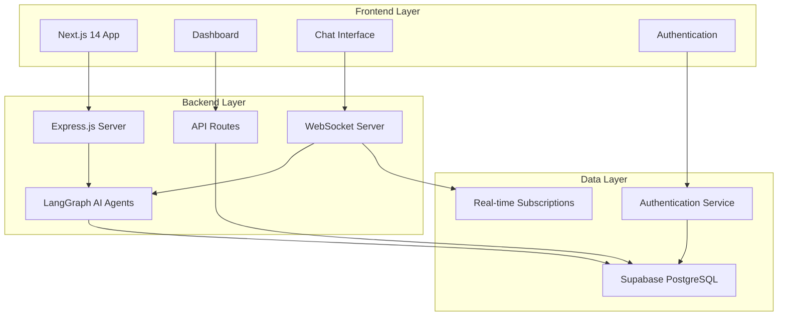
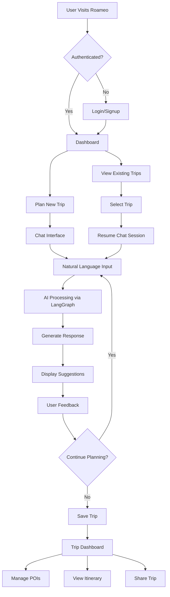
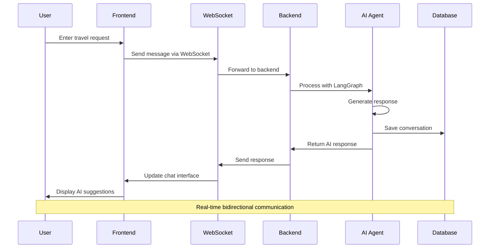
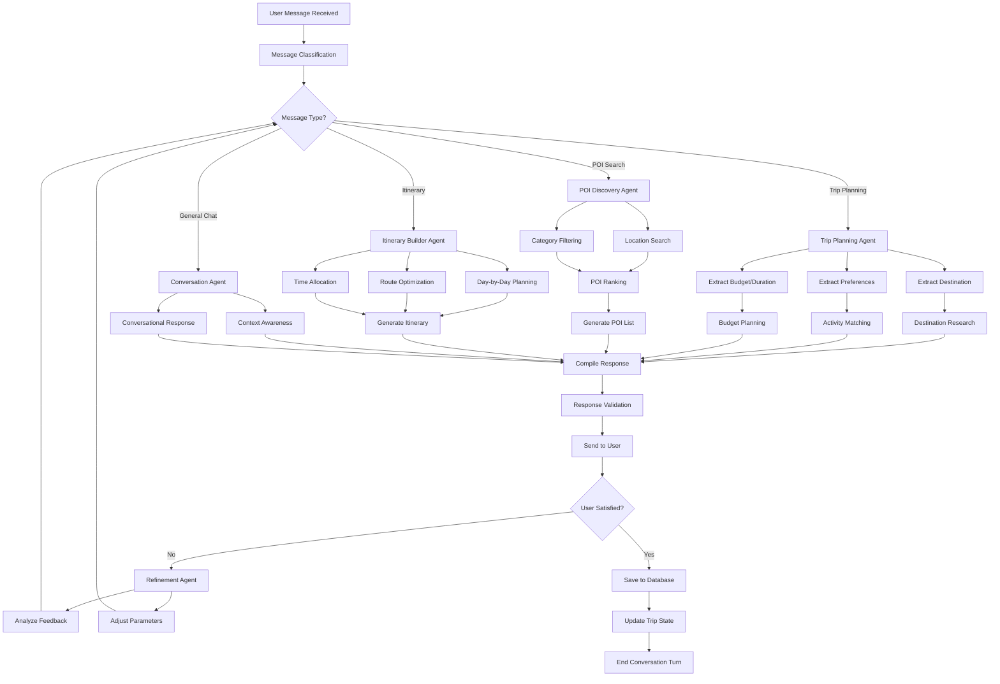
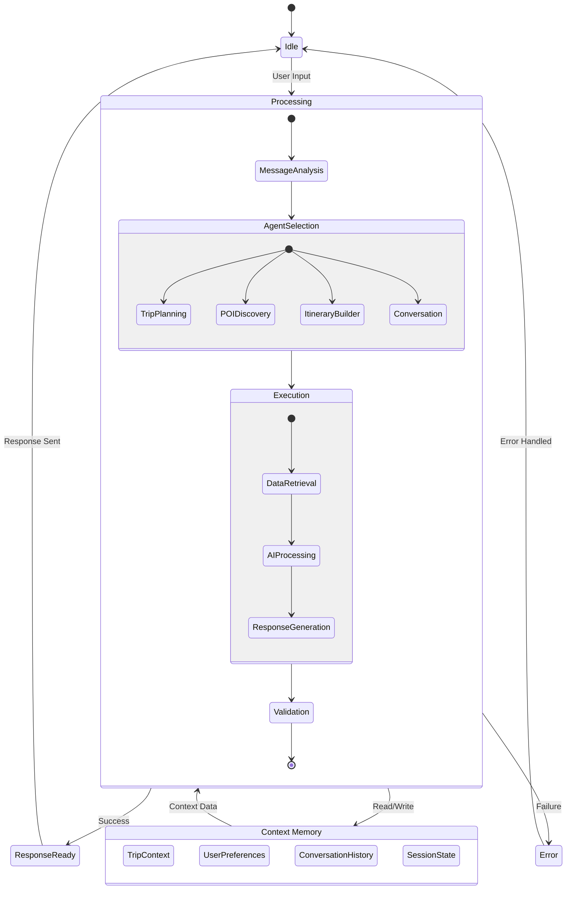

# Roameo - Multi-Agent AI Travel Planning Assistant

Roameo is an intelligent multi-agent AI travel planning platform that helps users create personalized itineraries through natural language conversations. Built with LangGraph multi-agent architecture and modern web technologies, it provides an intuitive chat-based interface powered by specialized AI agents for comprehensive trip planning.

## ✨ Current Implementation Status

**Frontend (Next.js 14)**: ✅ Fully Implemented
- Interactive dashboard with trip management
- Real-time chat interface with WebSocket integration
- Google Maps integration with POI visualization
- Responsive design with Tailwind CSS and Shadcn/ui
- Authentication system with Supabase Auth
- Multi-panel interface (chat, map, itinerary views)

**Backend (Node.js + TypeScript)**: ✅ Fully Implemented
- Express.js server with comprehensive API routes
- WebSocket server for real-time communication
- LangGraph multi-agent AI system with specialized agents
- Google Maps API integration with photo proxy
- Supabase PostgreSQL database integration
- Memcached caching layer for performance optimization
- Rate limiting and security middleware

**Database & Infrastructure**: ✅ Production Ready
- Supabase PostgreSQL with optimized schema
- Real-time database subscriptions
- User authentication and session management
- Message persistence and trip data storage
- Database health monitoring and connection pooling

## 🏗️ Architecture

### System Architecture Diagram


```mermaid
graph TB
    subgraph "Frontend Layer"
        A[Next.js 14 App]
        B[Dashboard]
        C[Chat Interface]
        D[Authentication]
    end
    
    subgraph "Backend Layer"
        E[Express.js Server]
        F[WebSocket Server]
        G[LangGraph AI Agents]
        H[API Routes]
    end
    
    subgraph "Data Layer"
        I[Supabase PostgreSQL]
        J[Authentication Service]
        K[Real-time Subscriptions]
    end
    
    A --> E
    B --> H
    C --> F
    D --> J
    E --> G
    F --> G
    G --> I
    H --> I
    J --> I
    F --> K
```

### Component Architecture

```
┌─────────────────────────────────────────────────────────────┐
│                    FRONTEND (Next.js 14)                   │
├─────────────────────────────────────────────────────────────┤
│  Dashboard    │    Chat Interface    │    Authentication    │
│  ┌─────────┐  │  ┌─────────────────┐ │  ┌─────────────────┐ │
│  │ Trip    │  │  │ Message Panel   │ │  │ Login/Signup    │ │
│  │ Cards   │  │  │ Input Field     │ │  │ User Profile    │ │
│  │ POI     │  │  │ WebSocket       │ │  │ Session Mgmt    │ │
│  │ Manager │  │  │ Connection      │ │  │                 │ │
│  └─────────┘  │  └─────────────────┘ │  └─────────────────┘ │
└─────────────────────────────────────────────────────────────┘
                            │
                    HTTP/WebSocket
                            │
┌─────────────────────────────────────────────────────────────┐
│                 BACKEND (Node.js + Express)                │
├─────────────────────────────────────────────────────────────┤
│  API Routes   │    WebSocket Server   │    AI Processing   │
│  ┌─────────┐  │  ┌─────────────────┐  │  ┌─────────────────┐ │
│  │ /trips  │  │  │ Chat Sessions   │  │  │ LangGraph       │ │
│  │ /pois   │  │  │ Real-time Msgs  │  │  │ Conversation    │ │
│  │ /auth   │  │  │ User Presence   │  │  │ Flow Engine     │ │
│  └─────────┘  │  └─────────────────┘  │  └─────────────────┘ │
└─────────────────────────────────────────────────────────────┘
                            │
                      Database Queries
                            │
┌─────────────────────────────────────────────────────────────┐
│                  DATABASE (Supabase)                       │
├─────────────────────────────────────────────────────────────┤
│     trips     │     messages     │     pois     │   users   │
│  ┌─────────┐  │  ┌─────────────┐ │  ┌─────────┐ │ ┌───────┐ │
│  │ id      │  │  │ id          │ │  │ id      │ │ │ id    │ │
│  │ title   │  │  │ session_id  │ │  │ name    │ │ │ email │ │
│  │ dest    │  │  │ content     │ │  │ coords  │ │ │ auth  │ │
│  │ created │  │  │ timestamp   │ │  │ trip_id │ │ └───────┘ │
│  └─────────┘  │  └─────────────┘ │  └─────────┘ │           │
└─────────────────────────────────────────────────────────────┘
```

### Technology Stack

**Frontend (Next.js 14 + TypeScript)**
- **Framework**: Next.js 14 with App Router and advanced optimizations
- **Styling**: Tailwind CSS + Shadcn/ui component library (54 components)
- **Authentication**: Supabase Auth with Google OAuth integration
- **State Management**: React hooks, context, and real-time subscriptions
- **Real-time**: WebSocket integration with health monitoring
- **Maps**: Google Maps JavaScript API with custom markers and InfoWindows
- **Image Optimization**: Next.js Image with proxy for Google Photos API
- **Build Tools**: Webpack with bundle splitting and SVG optimization

**Backend (Node.js + TypeScript)**
- **Runtime**: Node.js 18+ with TypeScript and ES modules
- **Framework**: Express.js with CORS and JSON middleware
- **AI Integration**: LangGraph JS with 9 specialized agents
- **Database**: Supabase PostgreSQL with connection pooling
- **Caching**: In-memory caching with database fallback (no external cache)
- **Real-time**: WebSocket server with session management
- **APIs**: Google Maps Places, Directions, and Photos APIs
- **AI Models**: Google Gemini 2.5 Flash and Pro for conversations
- **Security**: Rate limiting, input validation, and secure headers

### Database Schema
```sql
-- Complete Supabase PostgreSQL schema
chat_sessions: id, session_id, user_id, invite_id, trip (JSONB), created_at, updated_at
messages: id, session_id, user_id, role, content, created_at
saved_pois: id, session_id, user_id, poi_id, created_at
sessions: id, session_id, user_id, invite_id, trip (JSONB), created_at, updated_at

-- Optimized indexes for performance
idx_messages_session_id, idx_messages_user_id, idx_messages_created_at
idx_saved_pois_session_id, idx_chat_sessions_session_id
auto-updating triggers for timestamps
```

## 🤖 Multi-Agent AI Architecture

Roameo implements a sophisticated **multi-agent AI system** using LangGraph, where specialized agents collaborate to deliver comprehensive travel planning:

### **Specialized AI Agents** (9 Agents Implemented)

**🎯 Trip Planning Agent** (`planner.ts`)
- Extracts destination preferences, duration, and budget constraints
- Researches destination-specific information with Google Maps integration
- Creates structured markdown itineraries with day-by-day planning
- Generates accommodation, meals, and budget recommendations
- Handles multi-destination trips with travel time allocation

**📍 POI Discovery Agent** (`poi.ts`)
- Integrates with Google Maps Places API for real-time POI data
- Filters attractions, restaurants, and hotels by category
- Provides mock fallback data for 4 major destinations (Ooty, Mumbai, Goa, Delhi)
- Ranks points of interest based on ratings and relevance

**🗺️ Map Visualization Agent** (`map.ts`)
- Manages Google Maps integration with custom markers
- Handles world view defaults and POI clustering
- Provides directions and route optimization
- Creates interactive map experiences with InfoWindows

**💬 Conversation Agent** (`chat.ts`)
- Maintains conversation context and session memory
- Handles general chat and travel-related clarifications
- Manages real-time WebSocket communication
- Provides natural language responses with Gemini AI

**🎯 Intent Classification Agent** (`intent.ts`)
- Analyzes user messages to determine conversation intent
- Routes requests to appropriate specialized agents
- Maintains conversation flow and context switching

**Additional Agents**: Content Extraction (`extractor.ts`), Destination Research (`destination.ts`), Title Generation (`title.ts`), Router Coordination (`router.ts`)

### **Agent Coordination**
- **LangGraph Orchestration**: Coordinates agent workflows and decision routing
- **Shared Memory**: All agents access common trip context and user preferences
- **Dynamic Routing**: Intelligent message classification routes requests to appropriate agents
- **Feedback Loop**: Refinement agent processes user feedback to improve suggestions

## 🔄 Workflow

### User Journey Flow


```mermaid
flowchart TD
    A[User Visits Roameo] --> B{Authenticated?}
    B -->|No| C[Login/Signup]
    B -->|Yes| D[Dashboard]
    C --> D
    D --> E[View Existing Trips]
    D --> F[Plan New Trip]
    
    F --> G[Chat Interface]
    G --> H[Natural Language Input]
    H --> I[AI Processing via LangGraph]
    I --> J[Generate Response]
    J --> K[Display Suggestions]
    K --> L[User Feedback]
    L --> M{Continue Planning?}
    M -->|Yes| H
    M -->|No| N[Save Trip]
    
    E --> O[Select Trip]
    O --> P[Resume Chat Session]
    P --> H
    
    N --> Q[Trip Dashboard]
    Q --> R[Manage POIs]
    Q --> S[View Itinerary]
    Q --> T[Share Trip]
```

### Data Flow Architecture


```mermaid
sequenceDiagram
    participant U as User
    participant F as Frontend
    participant W as WebSocket
    participant B as Backend
    participant A as AI Agent
    participant D as Database
    
    U->>F: Enter travel request
    F->>W: Send message via WebSocket
    W->>B: Forward to backend
    B->>A: Process with LangGraph
    A->>A: Generate response
    A->>D: Save conversation
    A->>B: Return AI response
    B->>W: Send response
    W->>F: Update chat interface
    F->>U: Display AI suggestions
    
    Note over U,D: Real-time bidirectional communication
```

### AI Agent Workflow (LangGraph)


```mermaid
flowchart TD
    A[User Message Received] --> B[Message Classification]
    B --> C{Message Type?}
    
    C -->|Trip Planning| D[Trip Planning Agent]
    C -->|POI Search| E[POI Discovery Agent]
    C -->|Itinerary| F[Itinerary Builder Agent]
    C -->|General Chat| G[Conversation Agent]
    
    D --> H[Extract Destination]
    D --> I[Extract Preferences]
    D --> J[Extract Budget/Duration]
    H --> K[Destination Research]
    I --> L[Activity Matching]
    J --> M[Budget Planning]
    
    E --> N[Location Search]
    E --> O[Category Filtering]
    N --> P[POI Ranking]
    O --> P
    P --> Q[Generate POI List]
    
    F --> R[Day-by-Day Planning]
    F --> S[Route Optimization]
    F --> T[Time Allocation]
    R --> U[Generate Itinerary]
    S --> U
    T --> U
    
    G --> V[Context Awareness]
    G --> W[Conversational Response]
    
    K --> X[Compile Response]
    L --> X
    M --> X
    Q --> X
    U --> X
    V --> X
    W --> X
    
    X --> Y[Response Validation]
    Y --> Z[Send to User]
    
    Z --> AA{User Satisfied?}
    AA -->|No| BB[Refinement Agent]
    AA -->|Yes| CC[Save to Database]
    
    BB --> DD[Analyze Feedback]
    BB --> EE[Adjust Parameters]
    DD --> C
    EE --> C
    
    CC --> FF[Update Trip State]
    FF --> GG[End Conversation Turn]
```

### Agent State Management


```mermaid
stateDiagram-v2
    [*] --> Idle
    Idle --> Processing : User Input
    
    state Processing {
        [*] --> MessageAnalysis
        MessageAnalysis --> AgentSelection
        
        state AgentSelection {
            [*] --> TripPlanning
            [*] --> POIDiscovery
            [*] --> ItineraryBuilder
            [*] --> Conversation
        }
        
        AgentSelection --> Execution
        
        state Execution {
            [*] --> DataRetrieval
            DataRetrieval --> AIProcessing
            AIProcessing --> ResponseGeneration
        }
        
        Execution --> Validation
        Validation --> [*]
    }
    
    Processing --> ResponseReady : Success
    Processing --> Error : Failure
    
    ResponseReady --> Idle : Response Sent
    Error --> Idle : Error Handled
    
    state "Context Memory" as CM {
        TripContext
        UserPreferences
        ConversationHistory
        SessionState
    }
    
    Processing --> CM : Read/Write
    CM --> Processing : Context Data
```

### System Workflow Steps

1. **User Authentication**: Secure login/signup via Supabase
2. **Trip Creation**: Natural language input for travel preferences
3. **AI Processing**: LangGraph processes requests and generates responses
4. **Real-time Chat**: WebSocket-powered conversation interface
5. **Itinerary Building**: Dynamic POI suggestions and trip planning
6. **Trip Management**: Save, edit, and manage multiple trips

## ✨ Features Implemented

### 🎨 User Interface & Design
- **Modern Dashboard**: Clean, card-based trip overview with animated background elements
- **Destination Card Art**: Custom SVG artwork with 3 variants (stamp, aura, topo)
- **Responsive Design**: Mobile-first approach with Tailwind CSS and grid layouts
- **Interactive Chat**: Real-time messaging with typing indicators and message history
- **Multi-Panel Layout**: Resizable panels for chat, map, and itinerary views
- **54 UI Components**: Complete Shadcn/ui component library integration

### 🤖 AI & Conversation System
- **LangGraph Multi-Agent**: 9 specialized agents with intelligent routing
- **Natural Language Processing**: Google Gemini 2.5 Flash/Pro integration
- **WebSocket Real-time**: Bidirectional communication with health monitoring
- **Session Persistence**: Resume conversations across browser sessions
- **Context Awareness**: Maintains trip context and user preferences
- **POI Hover Cards**: Interactive POI information with inline actions

### 🗺️ Google Maps Integration
- **Places API**: Real-time POI discovery with photos and ratings
- **Interactive Maps**: Custom markers, InfoWindows, and clustering
- **Photo Proxy**: CORS-compliant image serving for Google Photos
- **Directions API**: Route optimization and travel time calculation
- **Mock Fallbacks**: Offline-capable with pre-defined POI data

### 🗄️ Data & Performance
- **Supabase Integration**: PostgreSQL with real-time subscriptions
- **In-Memory Caching**: Session and data caching for performance
- **Session Hydration**: Database-to-memory synchronization
- **Health Monitoring**: Database connection health checks
- **Connection Pooling**: Optimized database connection management

> **Note**: The current implementation uses in-memory caching with a no-op cache layer for simplicity. Memcached infrastructure is available but currently disabled to avoid connection complexity. This can be easily enabled in production for distributed caching.

### 🔐 Authentication & Security
- **Supabase Auth**: Email/password and Google OAuth integration
- **Protected Routes**: Middleware-based route protection
- **Rate Limiting**: 60 requests per minute per IP protection
- **Security Headers**: XSS protection, content sniffing prevention

## 📁 Project Structure

```
TTT/
├── Backend/                           # Node.js TypeScript backend
│   ├── src/
│   │   ├── agents/                   # LangGraph AI agents (9 agents)
│   │   │   ├── planner.ts           # Trip planning and itinerary generation
│   │   │   ├── poi.ts               # POI discovery and management
│   │   │   ├── chat.ts              # Conversation handling
│   │   │   ├── destination.ts       # Destination research
│   │   │   └── [5 more agents]      # Intent, extractor, map, router, title
│   │   ├── api/                     # Express.js API routes
│   │   │   ├── router.ts            # Main API router
│   │   │   ├── maps.ts              # Google Maps proxy
│   │   │   └── cache.ts             # Cache management API
│   │   ├── cache/                   # In-memory caching layer
   │   │   ├── cached-db.ts         # Database wrapper with caching
   │   │   └── memcached.ts         # Memcached implementation (unused)
│   │   ├── config/                  # Configuration management
│   │   ├── db/                      # Database abstraction layer
│   │   ├── tools/                   # External API integrations
│   │   ├── ws/                      # WebSocket implementation
│   │   └── index.ts                 # Server entry point
│   ├── dist/                        # Compiled JavaScript output
│   └── package.json                 # Dependencies and scripts
├── roameo-frontend/                  # Next.js 14 React frontend
│   ├── app/                         # App Router pages
│   │   ├── auth/                    # Authentication pages
│   │   ├── chat/                    # Chat interface
│   │   ├── dashboard/               # Main dashboard
│   │   └── profile/                 # User profile
│   ├── components/                  # React components (34 components)
│   │   ├── ui/                      # Shadcn/ui library (54 components)
│   │   ├── chat-interface.tsx       # Main chat component
│   │   ├── map-view.tsx             # Google Maps integration
│   │   ├── dashboard.tsx            # Trip dashboard
│   │   └── [30 more components]     # Additional UI components
│   ├── lib/                         # Utilities and configurations
│   │   ├── supabase/                # Supabase client configuration
│   │   ├── api.ts                   # API client functions
│   │   └── types.ts                 # TypeScript definitions
│   ├── public/                      # Static assets (56 files)
│   └── package.json                 # Dependencies and scripts
├── Database Schema/                  # SQL scripts
│   ├── database_schema.sql          # Core database schema
│   ├── database_performance_optimization.sql
│   └── rls_policies_final.sql       # Security policies
└── Documentation/                    # Project documentation
    ├── README.md                    # This file
    ├── IMPLEMENTATION_SUMMARY.md    # Implementation details
    └── MEMCACHED.md                 # Cache documentation
```

## 🚀 Getting Started

### Prerequisites
- Node.js 18+
- npm or yarn
- Supabase account

### Installation

1. **Clone the repository**
```bash
git clone <repository-url>
cd TTT
```

2. **Database Setup (Supabase)**
```bash
# Create a new Supabase project at https://supabase.com
# Run the database schema in SQL editor:
psql -d your_database < database_schema.sql
# Apply performance optimizations:
psql -d your_database < database_performance_optimization.sql
```

3. **Backend Setup**
```bash
cd Backend
npm install
cp .env.example .env
# Configure environment variables (see below)
npm run dev  # Starts on http://localhost:4000
```

4. **Frontend Setup**
```bash
cd roameo-frontend
npm install
cp .env.local.example .env.local
# Configure frontend environment variables
npm run dev  # Starts on http://localhost:3001
```

5. **Database Performance** (Optional)
```bash
# Apply performance optimizations
psql -d your_database < database_performance_optimization.sql
# Set up Row Level Security
psql -d your_database < rls_policies_final.sql
```

### Environment Variables

**Backend (.env)**
```bash
# Server Configuration
NODE_ENV=development
PORT=4000

# Google AI and Maps
GEMINI_API_KEY=your_gemini_api_key
GEMINI_MODEL_FLASH=gemini-2.5-flash
GEMINI_MODEL_PRO=gemini-2.5-pro
GOOGLE_MAPS_API_KEY=your_google_maps_api_key

# Supabase Database
SUPABASE_URL=your_supabase_project_url
SUPABASE_ANON_KEY=your_supabase_anon_key
SUPABASE_SERVICE_ROLE_KEY=your_supabase_service_role_key

# Optional APIs
TAVILY_API_KEY=your_tavily_api_key
```

**Frontend (.env.local)**
```bash
# Supabase Configuration
NEXT_PUBLIC_SUPABASE_URL=your_supabase_project_url
NEXT_PUBLIC_SUPABASE_ANON_KEY=your_supabase_anon_key

# Backend API Configuration
NEXT_PUBLIC_API_URL=http://localhost:4000
NEXT_PUBLIC_WS_URL=ws://localhost:4000/ws
```

### API Keys Setup Guide

1. **Google AI Studio**: Get Gemini API key from [Google AI Studio](https://aistudio.google.com/app/apikey)
2. **Google Cloud Console**: Enable Maps JavaScript API, Places API, and Directions API
3. **Supabase**: Create project at [supabase.com](https://supabase.com) and get URL/keys
4. **Tavily (Optional)**: Get search API key from [tavily.com](https://tavily.com)

### Required API Services
- ✅ **Google Gemini AI**: Conversation and planning intelligence
- ✅ **Google Maps Platform**: POI discovery, photos, and directions
- ✅ **Supabase**: Database, authentication, and real-time features
- 🔄 **Tavily Search**: Enhanced web search (optional)

## 🛣️ Roadmap & Future Enhancements

### 🎨 UI/UX Improvements
- [ ] **Dark Mode**: Complete theme switching with system preference detection
- [ ] **Enhanced Animations**: Framer Motion micro-interactions and page transitions
- [ ] **Mobile Optimization**: Progressive Web App (PWA) with offline support
- [ ] **Advanced Filtering**: Multi-criteria POI filtering and sorting
- [ ] **Accessibility**: WCAG 2.1 AA compliance and screen reader optimization
- [ ] **Multi-language**: i18n support for global markets

### 🚀 Performance & Scalability
- [ ] **CDN Integration**: Global content delivery for faster loading
- [ ] **Image Optimization**: Advanced WebP/AVIF conversion and compression
- [ ] **Database Sharding**: Horizontal scaling for large user bases
- [ ] **External Caching**: Redis or Memcached integration for distributed caching
- [ ] **Edge Computing**: Deploy functions closer to users globally
- [ ] **Monitoring**: Application performance monitoring (APM) integration

### 🤖 AI & Intelligence Enhancements
- [ ] **Voice Integration**: Speech-to-text for hands-free trip planning
- [ ] **Image Recognition**: Photo-based POI discovery and recommendations
- [ ] **Predictive Analytics**: Weather-aware and crowd-based suggestions
- [ ] **Personalization**: ML-driven recommendations based on user history
- [ ] **Multi-language AI**: Gemini models for non-English conversations
- [ ] **Advanced Agents**: Hotel booking, flight search, and activity reservation agents

### 🌐 API & Integration Expansions
- [ ] **Booking APIs**: Integrate Booking.com, Expedia, Airbnb for reservations
- [ ] **Flight APIs**: Amadeus or Skyscanner for flight recommendations
- [ ] **Weather APIs**: Real-time weather integration for trip planning
- [ ] **Currency APIs**: Live exchange rates and budget calculations
- [ ] **Calendar Integration**: Google Calendar, Outlook, Apple Calendar sync
- [ ] **Social Platforms**: Instagram, TikTok integration for travel inspiration

## 🤝 Contributing

1. Fork the repository
2. Create a feature branch (`git checkout -b feature/amazing-feature`)
3. Commit your changes (`git commit -m 'Add amazing feature'`)
4. Push to the branch (`git push origin feature/amazing-feature`)
5. Open a Pull Request

## 📄 License

This project is licensed under the MIT License - see the [LICENSE](LICENSE) file for details.

## 🙏 Acknowledgments

- Built with [Next.js](https://nextjs.org/) and [Supabase](https://supabase.com/)
- UI components from [Shadcn/ui](https://ui.shadcn.com/)
- AI powered by [LangGraph](https://langchain-ai.github.io/langgraph/)
- Icons from [Lucide React](https://lucide.dev/)

---

**Roameo** - Making travel planning as easy as having a conversation ✈️
